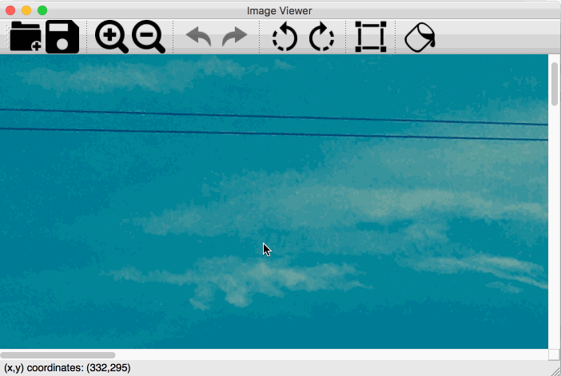
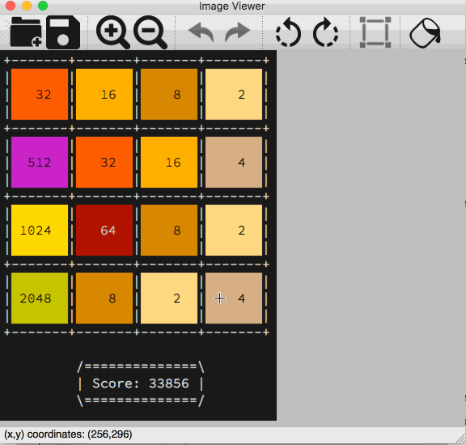
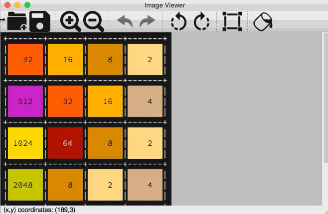

# ImageViewer
Basic Image Viewer and Editor written in C++ using QT.

This project was made solely for purpose of learning QT library.
It was tested to work only on OS X.

Features:
- Opening images
- Saving images
- Zooming In / Out
- Rotating left / right
- Cropping images
- Changing colourful images to black and white
- Undo / Redo edit actions
- Showing mouse cursor coordinates relative to image in status bar
- Hiding toolbar
- Toggling fullscreen mode

# Icons
All icons used in this project are free to use. You can download them here:
- https://www.iconfinder.com/icons/763355/add_collection_document_documents_editor_file_folder_group_new_open_icon#size=256
- https://www.iconfinder.com/icons/106237/in_zoom_icon#size=128
- https://www.iconfinder.com/icons/326686/left_rotate_icon#size=256
- https://www.iconfinder.com/icons/326687/right_rotate_icon#size=256
- https://www.iconfinder.com/icons/763371/crop_edit_editor_resize_icon#size=256
- https://www.iconfinder.com/icons/326688/floppy_save_icon#size=256
- https://www.iconfinder.com/icons/1021026/paint_icon#size=256
- https://www.iconfinder.com/icons/211811/redo_icon#size=256
- https://www.iconfinder.com/icons/211838/undo_icon#size=256

# Licence
The software is available as open source under the terms of the [MIT License](https://opensource.org/licenses/MIT).
